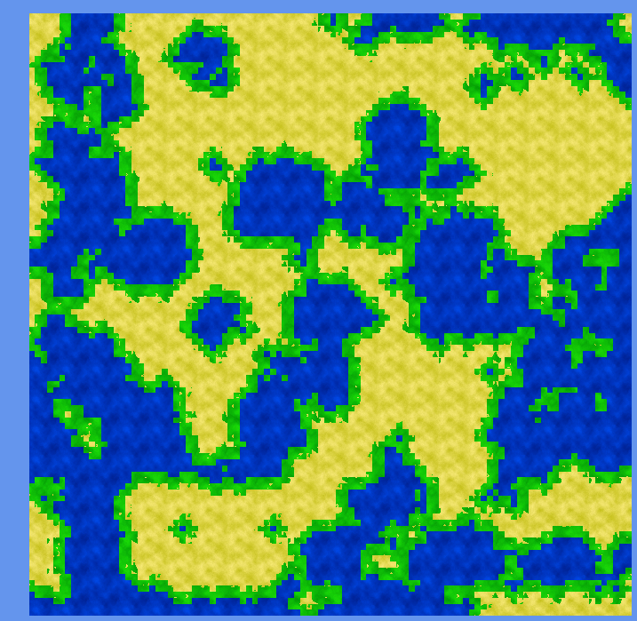

# EvoNet

An evolution simulation in .Net

## Overview

For the base simulation a TileMap is generated which seperates the tilemap into land and water.
Land is fertile and grass/food can grow, which grow speed is dependent in its neighboring tiles.

On this world creatures live, eat and reproduce (to be implemented)

## Project Setup

This project uses [MonoGame](http://www.monogame.net/), for installation instructions see http://www.monogame.net/downloads/ .

In addition some libraries are referenced using [NuGet](https://www.nuget.org/).

Main development is done using Visual Studio 2015, other platforms might work but are unsupported and not tested.

## Management

Issue tracking and work distribution is done using [waffle.io](https://waffle.io/pampersrocker/EvoNet)
